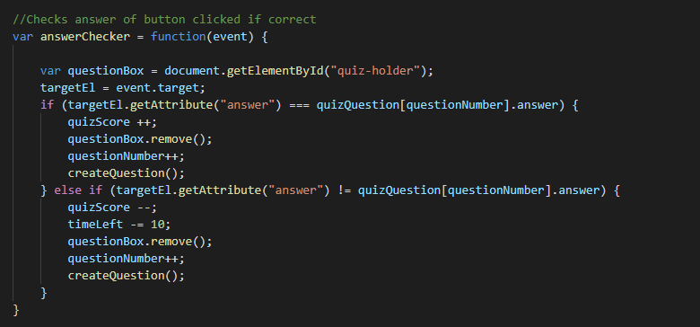
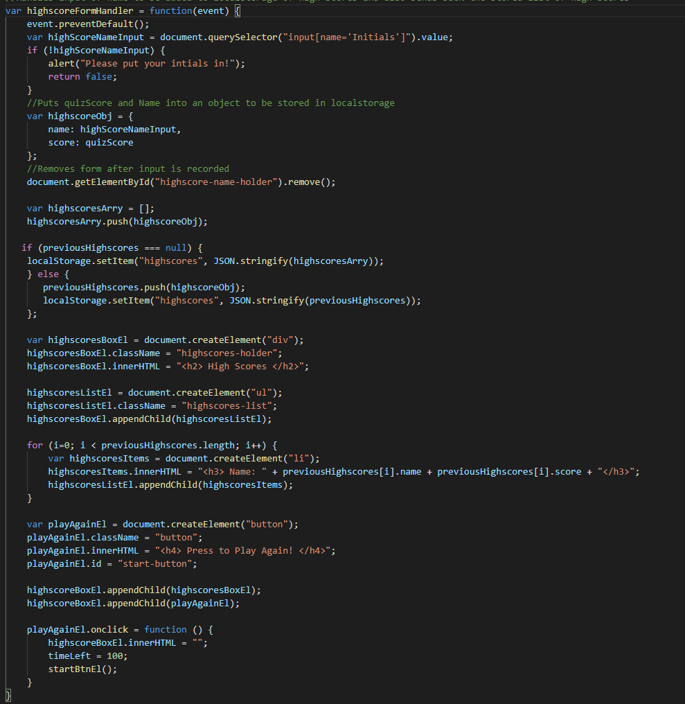

# Coding Quizer

## Description
  This is my first time coding a whole game from scratch. The most challenging part for me was definetly getting my high scores to display. The easiest was manipulating doms. I do need a lot more work on global variables and having them be declared on the global scope. First I wanted to get a proof of concept working so I built out my game timer and the buttons. I did this by using set interval to make a function that counts down every second. I also added an if statement that allowed the question to be changed every 10 seconds by checking if the timeLeft was divisble by 10. For the answer checker I made an on click event that checked if the button's clicked id was the same as the answer id. If so it would add one point display correct and progress the game. If not it would subtract points display incorrect and switch the question. 
  
## Installation
  Deployment url below! or if you would like to pull the code and see for yourself,
  git clone "https:/https://github.com/aaronquach123/codingquizer.git"
## Usage
  Please feel free to submit issues with my code if you see any way I can streamline it or improve it!
## Deployment
 https://aaronquach123.github.io/codingquizer

## Screenshots

## Credits
W3 schools showed me a lot of ways I can use DOM commands and stack overflow helped me troubleshoot a lot of the problems I was having!
